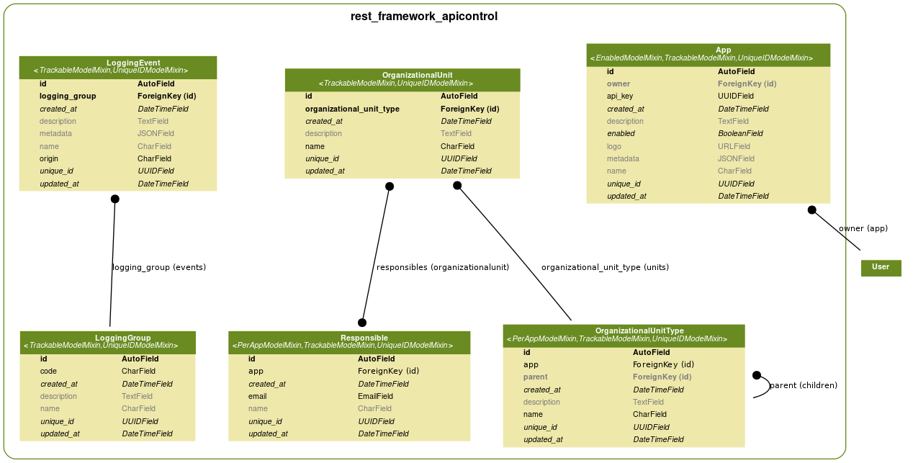

# djangorestframework-apicontrol

This is an App intended to control Clients Apps access over REST APIs.

## Notice
```
Please be carefull with the use of this package, and remember to backup your database before apply each migration.
```

## Permission Usage (APIKey)
you only has to import the permission and use it in your rest_framework views, or in your settings.py file, as you prefer. e.g:

``` python
"""Contact views."""
from rest_framework import viewsets
from rest_framework_apicontrol.permissions import HasApiKeyPermission
from .models import (
    ContactInfo
)
from .serializers import (
    ContactInfoSerializer
)


class ContactInfoViewSet(viewsets.ModelViewSet):
    queryset = ContactInfo.objects.all()
    serializer_class = ContactInfoSerializer
    permission_classes = [HasApiKeyPermission]
    authentication_classes = []

```

All the calls to this endpoint **MUST HAVE** a header called **Api-Key** with the value of an App(App model in Django admin site)

## Models
This app comes with several models & mixins which provide useful common fields & functions, the models it provides are the following:



To add those models to your app the only you need to do is add `rest_framework_apicontrol` to your project `INSTALLED_APPS` setting & then migrate your app.
``` python
INSTALLED_APPS = [
    # Django default modules
    'django.contrib.admin',
    'django.contrib.auth',
    'django.contrib.contenttypes',
    'django.contrib.sessions',
    'django.contrib.messages',
    'django.contrib.staticfiles',
    # Security & multi-app management
    'rest_framework_apicontrol',
    # Your project apps
    '...',
]
```

**Notice:** This project's models needs PostgreSQL as database because the use of JSONField in some of it's model fields.


## Donate
If this project is useful for you, please donate some dollars to help me improve this & others projects.

My Paypal - http://paypal.me/mcuetodeveloper
